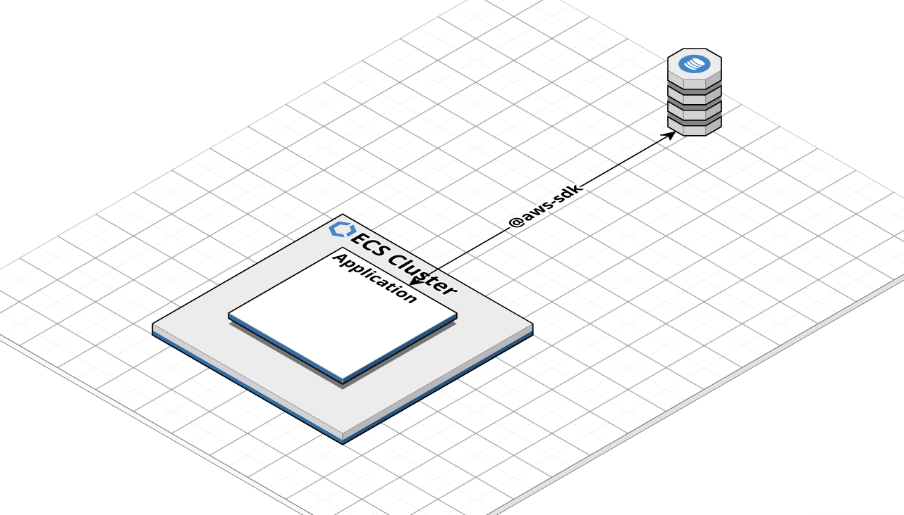
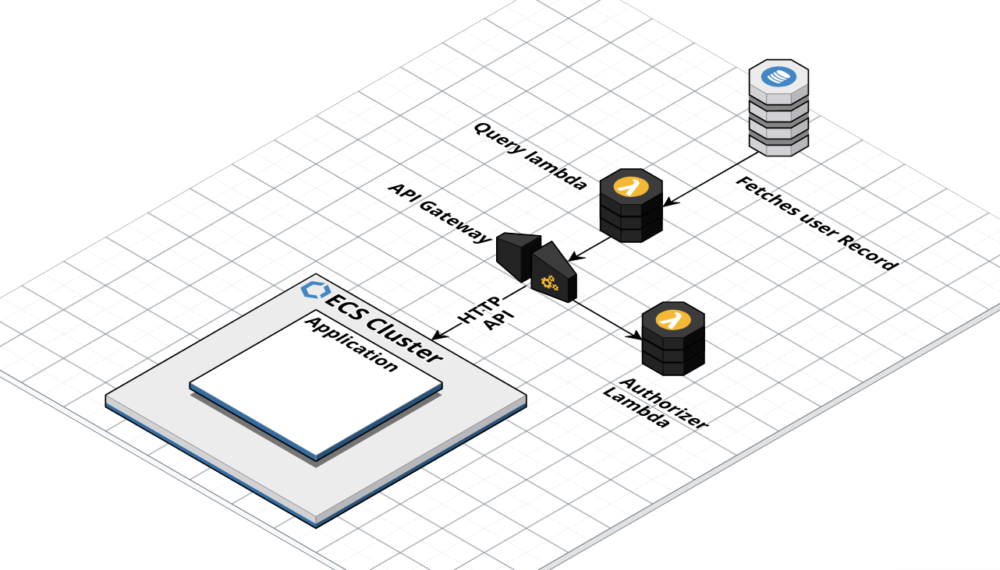
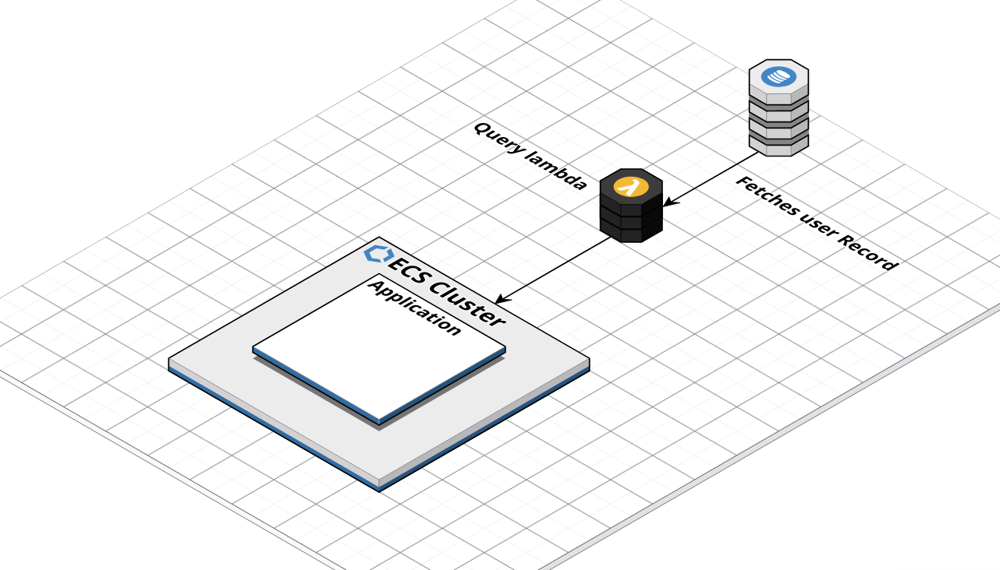

# Reading "Services you have used" Data from the account store into the App

## Summary
- We will use the AWS SDK to retrieve data directly from the Account User service store
- We have decided to NOT use AWS API Gateway
- We have decided to NOT place a lambda between the dynamo and the account management application

## Decision

We will use the AWS SDK to directly query the data store from the express application.

We picked this option as it is extremely simple, requiring one dependency added to the app, and no extra AWS components.

The trade off is to accept coupling a Dynamo tightly with our Fargate frontends in exchange for lower complexity. We feel that is justified as it will speed our implimentation and the coupled services are unlikely to change much in the near future.

It also makes core functionality depend on the AWS SDKs instead of implementation agnostic HTTP APIs.

However, as a program we have committed to AWS, and so are not concerned about vendor lock in, in this case.
And the database is quite specific to this application, reducing chances they will need to be in separate accounts in future.

This seemed like the pragmatic choice.

## Other options considered

### API Gateway

We considered placing an API gateway between the application and data store.
The option would use a lambda to query the correct record from the data store.
Another lambda authorises data access.

The express application, running in Fargate, would then query using an HTTP API.

Pros:
- Applications can make requests for data in HTTP, abstracted from implementation.

Cons:
- More components and complication than alternatives

We rejected this option. Deciding the benefits did not outweigh the complexity.

### Placing a lambda between the app and the database

We considered placing a lambda between the application and the data store.
This would query out data and provide a standard lambda access point to the data store.

This would allow us later to maintain this component as independent of the application.
Meaning we could more easily refactor this section if we wished to replace our containerised express frontends, with serverless function web applications in future.

We rejected this option as replacing our frontends is not planned work. We could add in this lambda at a later date when a need arose.

## Consequence
- This application and the data store will need to be within the same AWS Account
- We must add the @aws-sdk into as a dependency of this application
- Core functionality uses the @aws-sdk and not a platform agnostic HTTP API
- We can deliver a solution more quickly than alternatives
