# Account Management Frontend — Architecture

```mermaid
graph TB
    %% ===== EXTERNAL ACTORS =====
    User([User / Browser])
    OIDC_IDP(["GOV.UK Sign In<br/>OIDC Identity Provider"])
    AMC(["Account Management<br/>Components API"])
    TxMA(["TxMA<br/>Audit Platform"])
    MethodMgmt([Method Management API])

    %% ===== EDGE LAYER =====
    subgraph Edge["Edge Layer"]
        WAF_CF["WAF WebACL"]
        CloudFront["CloudFront<br/>Distribution"]
        CloakingWAF["Cloaking Origin<br/>WAF WebACL"]
    end

    %% ===== API GATEWAY =====
    subgraph APIGW["API Gateway (eu-west-2)"]
        ApiGateway["API Gateway<br/>HTTP / Regional"]
        VPCLink[VPC Link]
    end

    %% ===== COMPUTE =====
    subgraph Compute["ECS Fargate (eu-west-2)"]
        ALB["Internal ALB<br/>HTTPS :443"]
        ECSCluster[ECS Cluster]
        ECSService["ECS Service<br/>Fargate Tasks"]
        Container["Express App<br/>Node.js 20 + Nunjucks SSR"]
    end

    %% ===== APPLICATION COMPONENTS =====
    subgraph AppComponents["Application Features"]
        Security["Security Settings<br/>Change Email / Password / Phone"]
        MFA["MFA Management<br/>Add / Remove / Switch Methods"]
        Passkeys["Passkey Management<br/>Create / Remove Passkeys"]
        ActivityHistory["Activity History<br/>+ Report Suspicious Activity"]
        YourServices["Your Services<br/>+ Search Services"]
        DeleteAccount[Delete Account]
        BackchannelLogout["Backchannel Logout<br/>RP-initiated"]
    end

    %% ===== DATA STORES =====
    subgraph DataStores["Data Stores (eu-west-2)"]
        DDB_Sessions[("DynamoDB<br/>Session Store")]
        DDB_Services[("DynamoDB<br/>User Services")]
        DDB_ActivityLog[("DynamoDB<br/>Activity Log")]
        DDB_Notifications[("DynamoDB<br/>User Notifications")]
    end

    %% ===== MESSAGING =====
    subgraph Messaging["Messaging"]
        AuditQueue["SQS<br/>Audit Events Queue"]
        AuditDLQ["SQS<br/>Audit DLQ"]
        NotificationQueue["SQS<br/>Notification Queue"]
        SNS_Delete["SNS<br/>User Account Deletion Topic"]
        SNS_Suspicious["SNS<br/>Suspicious Activity Topic"]
    end

    %% ===== KMS =====
    subgraph KMS["KMS Keys"]
        JwtSigningKey["JWT Signing Key<br/>Sign / GetPublicKey"]
        DynamoDBKey["DynamoDB SSE Key<br/>Symmetric"]
        SecretsKey["Secrets KMS Key<br/>Symmetric"]
        LoggingKey["Logging KMS Key<br/>Symmetric"]
        QueueKey["Queue KMS Key<br/>Symmetric"]
        GeneratorKey["Generator Key<br/>Decrypt"]
    end

    %% ===== SECRETS & CONFIG =====
    subgraph Config["Secrets & Configuration"]
        SecretsManager["Secrets Manager<br/>Session Secret<br/>Publishing API Key"]
        SSM["SSM Parameters<br/>OIDC Client ID<br/>GTM ID<br/>SNS ARNs"]
    end

    %% ===== OBSERVABILITY =====
    subgraph Observability["Observability"]
        CloudWatch["CloudWatch<br/>Logs + Metrics + Alarms"]
        Dynatrace["Dynatrace<br/>OneAgent + RUM"]
        CSLS["CSLS / Splunk<br/>Log Subscription"]
    end

    %% ===== NETWORKING =====
    subgraph Networking["Networking"]
        VPC["VPC<br/>Protected Subnets"]
        R53["Route 53<br/>home.env.account.gov.uk"]
        ACM[ACM Certificate]
    end

    %% ===== CI/CD =====
    subgraph CICD["CI/CD"]
        CodeDeploy["CodeDeploy<br/>Blue/Green ECS Deployment"]
        ECR["ECR<br/>Container Registry"]
    end

    %% ===== EXTERNAL SERVICES =====
    subgraph External["External Services"]
        GOVPublishing[GOV.UK Publishing API]
        Webchat[SmartAgent Webchat]
    end

    %% ===== REQUEST FLOW: USER → APP =====
    User --> WAF_CF
    WAF_CF --> CloudFront
    CloudFront --> CloakingWAF
    CloakingWAF --> ApiGateway
    ApiGateway --> VPCLink
    VPCLink --> ALB
    ALB --> ECSService
    ECSService --> Container

    %% ===== APP FEATURES =====
    Container --> Security
    Container --> MFA
    Container --> Passkeys
    Container --> ActivityHistory
    Container --> YourServices
    Container --> DeleteAccount
    Container --> BackchannelLogout

    %% ===== CONTAINER → AWS SERVICES =====
    Container --> DDB_Sessions
    Container --> DDB_Services
    Container --> DDB_ActivityLog
    Container --> DDB_Notifications
    Container --> AuditQueue
    Container --> NotificationQueue
    Container --> SNS_Delete
    Container --> SNS_Suspicious
    Container --> JwtSigningKey
    Container --> GeneratorKey
    Container --> SecretsManager
    Container --> SSM

    %% ===== CONTAINER → EXTERNAL APIs =====
    Container --> OIDC_IDP
    Container --> AMC
    Container --> MethodMgmt
    Container --> GOVPublishing

    %% ===== AUDIT FLOW =====
    AuditQueue --> TxMA
    AuditQueue -.-> AuditDLQ

    %% ===== DNS & NETWORKING =====
    R53 --> CloudFront

    %% ===== OBSERVABILITY =====
    Container --> CloudWatch
    Container --> Dynatrace
    CloudWatch --> CSLS
```

## Component Summary

### Edge & Ingress

| Component    | Description                                                             |
| ------------ | ----------------------------------------------------------------------- |
| WAF WebACL   | WAF attached to CloudFront for DDoS/bot protection                      |
| CloudFront   | CDN distribution fronting the application (managed by dev-platform)     |
| Cloaking WAF | WebACL attached to the ALB ensuring traffic only arrives via CloudFront |
| API Gateway  | HTTP API Gateway with VPC Link integration to the internal ALB          |
| Route 53     | DNS record for `home.{env}.account.gov.uk` pointing to CloudFront       |

### Compute (ECS Fargate)

| Component    | Description                                                                  |
| ------------ | ---------------------------------------------------------------------------- |
| ECS Cluster  | Fargate cluster with auto-scaling (step scaling on CPU utilisation)          |
| ECS Service  | Blue/Green deployment via CodeDeploy; min 3–6 tasks depending on environment |
| Container    | Node.js 20 (Alpine) Express app with Nunjucks SSR, port 6001                 |
| Internal ALB | HTTPS listener with TLS 1.2, health checks on `/healthcheck`                 |

### Application Features

| Feature            | Routes                                                                                                                    | Description                                             |
| ------------------ | ------------------------------------------------------------------------------------------------------------------------- | ------------------------------------------------------- |
| Security Settings  | `/security`, `/change-email`, `/change-password`, `/change-phone-number`                                                  | Manage email, password, phone number                    |
| MFA Management     | `/choose-backup`, `/set-up-auth-app`, `/add-mfa-method-sms`, `/remove-backup`, `/switch-method`, `/change-default-method` | Add/remove/switch SMS and authenticator app MFA methods |
| Passkey Management | `/sign-in-details`, `/create-new-passkey`, `/remove-passkey`                                                              | Create and remove passkeys via AMC integration          |
| Activity History   | `/activity-history`, `/activity-history/report-activity`                                                                  | View sign-in history and report suspicious activity     |
| Your Services      | `/your-services`, `/services-using-one-login`                                                                             | View and search services using GOV.UK One Login         |
| Delete Account     | `/delete-account`                                                                                                         | Delete user account (publishes to SNS)                  |
| Backchannel Logout | `/backchannel-logout`                                                                                                     | RP-initiated logout via signed JWT                      |

### External API Integrations

| API                                        | Purpose                                                                                 |
| ------------------------------------------ | --------------------------------------------------------------------------------------- |
| GOV.UK Sign In (OIDC)                      | User authentication via OpenID Connect (discovery, authorize, token, userinfo)          |
| Account Management Components (AMC)        | Passkey creation journeys — authorize, token exchange, journey outcome                  |
| Account Management API (`AM_API_BASE_URL`) | Backend API for password auth, email/phone updates, account deletion, OTP notifications |
| Method Management API                      | CRUD operations on MFA methods and passkeys                                             |
| GOV.UK Publishing API                      | Account linking with GOV.UK publishing platform                                         |

### Data Stores

| Store                         | Purpose                                                                                              |
| ----------------------------- | ---------------------------------------------------------------------------------------------------- |
| DynamoDB — Session Store      | Express sessions with TTL, Global Secondary Index for user-based session lookup (backchannel logout) |
| DynamoDB — User Services      | Records of services the user has accessed                                                            |
| DynamoDB — Activity Log       | Sign-in activity history                                                                             |
| DynamoDB — User Notifications | Pending user notifications (read & delete)                                                           |

### Messaging

| Resource                    | Purpose                                                   |
| --------------------------- | --------------------------------------------------------- |
| SQS — Audit Events Queue    | TxMA audit events sent to cross-account audit platform    |
| SQS — Audit DLQ             | Dead letter queue for failed audit event delivery         |
| SQS — Notification Queue    | Email/SMS notification requests                           |
| SNS — User Account Deletion | Publishes account deletion events to downstream consumers |
| SNS — Suspicious Activity   | Publishes suspicious activity reports                     |

### KMS Keys

| Key              | Purpose                                                        |
| ---------------- | -------------------------------------------------------------- |
| JWT Signing Key  | Signs JWTs and exposes public key via `/.well-known/jwks.json` |
| Generator Key    | Decrypts data from the backend (AWS Encryption SDK)            |
| DynamoDB SSE Key | Encrypts session store table at rest                           |
| Secrets KMS Key  | Protects Secrets Manager values (session secret)               |
| Logging KMS Key  | Encrypts CloudWatch log groups                                 |
| Queue KMS Key    | Encrypts SQS messages (audit DLQ)                              |
| SNS KMS Key      | Encrypts SNS topic messages                                    |

### Observability

| Component         | Description                                                                    |
| ----------------- | ------------------------------------------------------------------------------ |
| CloudWatch Logs   | ECS task logs and API Gateway access logs (30-day retention, KMS encrypted)    |
| CloudWatch Alarms | 5xx/4xx rates, latency, traffic spikes, logger errors, OIDC discovery failures |
| Anomaly Detection | Anomaly detectors on ELB 4xx/5xx counts                                        |
| Dynatrace         | OneAgent sidecar + RUM JavaScript for APM                                      |
| CSLS/Splunk       | Log subscription filters for integration and production environments           |

### CI/CD

| Component    | Description                                              |
| ------------ | -------------------------------------------------------- |
| ECR          | Container image registry                                 |
| CodeDeploy   | Blue/Green ECS deployments with rollback on alarm breach |
| Code Signing | Lambda code signing (for canary deployment Lambda)       |
